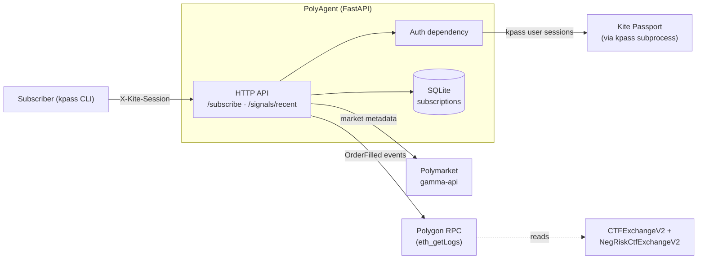

# PolyAgent

**Polymarket copy-trading service, Kite-native, settled in USDC via Kite Agent Passport.**

PolyAgent is the first prediction-market signal service built on Kite Mainnet (launched April 30, 2026). Subscribers grant a scoped spending session via Kite Agent Passport, register the on-chain wallets they want to copy, and receive enriched real-time fills directly from Polygon — no Polymarket API dependency, no geoblocking.

> Status: v0.0.6 — feature-complete except for settlement.
> Built in a single session, three days after Kite Mainnet launch.

---

## What it does

A subscriber holding a Kite Agent Passport session points PolyAgent at one or more "whale" wallets on Polymarket. PolyAgent watches Polygon for V2 `OrderFilled` events touching those wallets, decodes them, enriches with market metadata from Polymarket's `gamma-api`, and serves the result back over an authenticated HTTP API.

The auth flow is sovereign: every request is verified against Kite Passport via the official `kpass` CLI before any data is returned. The on-chain read path is sovereign: events come straight from Polygon RPC, not from a centralised Polymarket trades endpoint that geoblocks several regions.

## Architecture



## API

All endpoints except `/health` require an `X-Kite-Session` header containing a valid Kite Agent Passport session ID. Auth is verified against the kpass CLI on every request.

| Method | Path                       | Description                                            |
| ------ | -------------------------- | ------------------------------------------------------ |
| GET    | `/health`                  | Liveness probe. Open.                                  |
| POST   | `/subscribe`               | Register a target wallet to follow.                    |
| GET    | `/subscriptions`           | List active subscriptions for the calling session.     |
| DELETE | `/subscriptions/{id}`      | Soft-delete a subscription owned by this session.      |
| GET    | `/signals/recent`          | Recent enriched on-chain fills for a subscribed wallet.|

`/signals/recent` accepts `wallet` (required), `limit` (1-50, default 10) and `lookback_blocks` (100-100000, default 10000 ≈ 6 hours).

Every response carries an `X-Request-ID` header. If you supply one on the request it is reflected; otherwise the service generates one. Logs include the same id so end-to-end tracing is one grep.

## Running it

### Locally

```bash
python -m venv .venv
source .venv/bin/activate
pip install -r requirements.txt
uvicorn polyagent.main:app --reload
```

The kpass CLI must be installed and on `PATH` for any auth-gated endpoint to work — see the [Kite Passport docs](https://docs.gokite.ai). `/health` works without it.

### With Docker

```bash
docker compose up --build
```

The compose file mounts the host's `kpass` binary into the container at `/usr/local/bin/kpass` and persists SQLite to a named volume.

### Tests

```bash
pip install -r requirements-dev.txt
pytest
ruff check .
```

The test suite stubs out kpass, Polygon RPC and gamma-api; no network or subprocess calls are made.

## Configuration

| Env var                | Default                                 | Notes                                  |
| ---------------------- | --------------------------------------- | -------------------------------------- |
| `POLYAGENT_DB_PATH`    | `./polyagent.db`                        | SQLite file location.                  |
| `POLYAGENT_LOG_LEVEL`  | `INFO`                                  | Standard Python log levels.            |

## Hard-earned context

A handful of decisions look unusual but are deliberate — the kpass CLI subprocess (no public REST API), the bespoke V2 `OrderFilled` decoder (no web3.py), the specific Polygon RPC endpoints (verified working from India). They are documented in [`CONTEXT.md`](./CONTEXT.md). Read it before changing anything in `polygon.py`, `passport.py`, or the choice of database/RPC.

## Roadmap

- **Block C — settlement.** `kpass wallet send` for USDC transfers on Kite Mainnet. (Kite USDC is bridged USDC.e and does not implement EIP-3009, so generic x402 is not an option — see CONTEXT.md.)
- **WebSocket push.** Long-lived subscriber streams instead of polling `/signals/recent`.
- **Per-wallet PnL aggregation.** Today the service is fill-by-fill; a roll-up per market would help subscribers size copies.
- **Postgres migration.** Only when multi-tenant load is real. Until then aiosqlite is enough.
